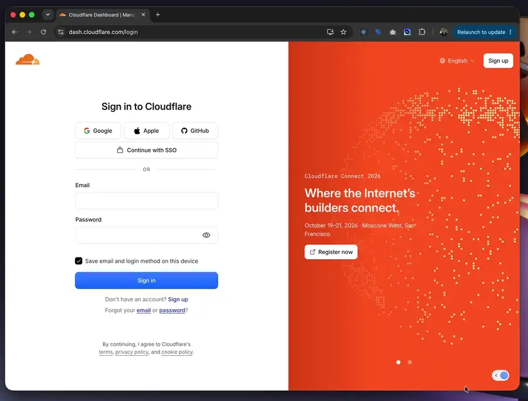
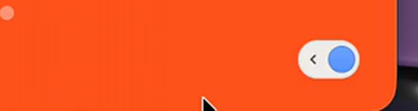
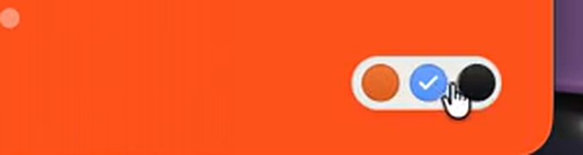
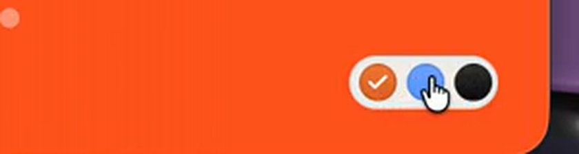

# chrome-live-toggle skill

Inject a floating control into someone else's live web page through a controlled
Chrome, so a human can click it to flip a reversible change, and it survives a
reload. For demoing "what if this button were orange" on a real production page
without a fork, a build, or a screenshot mockup.

Two modes, picked by how many states the change has:

| Mode       | States       | Template                       | Seams                      |
| ---------- | ------------ | ------------------------------ | -------------------------- |
| **Toggle** | 2 (on / off) | `reference/toggle-template.js` | `applyOn` / `applyOff`     |
| **Swatch** | N            | `reference/swatch-template.js` | `SWATCHES` / `applySwatch` |

## How it looks like

Only the swatch is recorded below. A toggle demo comes later.



Injected into a live `dash.cloudflare.com/login`. Hover expands the pill
leftward, the chevron and preview dot fade out and the swatch dots fade in;
clicking one moves the checkmark and recolors the page's Sign in button live.
Unhover collapses it back right.

Source recording: [`chrome-live-toggle-swatch-demo.mp4`](chrome-live-toggle-swatch-demo.mp4)

### States

| Idle                     | Hover                      | After picking orange         |
| ------------------------ | -------------------------- | ---------------------------- |
|  |  |  |

Idle is a `‹` chevron plus one dot of the active value. Hovered, all three
swatches show with the checkmark on the active one, here blue, the page's own
button color. Clicking orange moves the check and repaints the target.

### The change it drives

| Before                       | After                      |
| ---------------------------- | -------------------------- |
|  |  |

The dot's `color` is what it renders; `value` is what `applySwatch` consumes.
Buttons like this one paint their fill through an overlay child fed by CSS
custom properties, so setting `background-color` reads back fine and changes
nothing on screen. See "Recoloring a component" in `SKILL.md`.

## Installation

```bash
npx skills add wzulfikar/skills --skill chrome-live-toggle
```

To check for updates: `npx skills update chrome-live-toggle`

> **To install multiple skills**
> Run `npx skills add wzulfikar/skills` without
> `--skill` and pick the skills you want from the list.

Then invoke it as `/chrome-live-toggle` in a new session.

**It needs a controlled Chrome with a debug port** and the chrome-devtools MCP
attached to it. Persistence rides on `navigate_page`'s `initScript`, which the
`claude-in-chrome` extension path does not expose, so through that path the
injection is wiped on the first reload.
