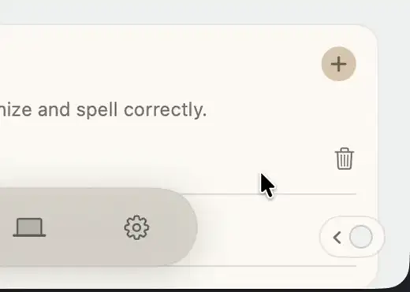
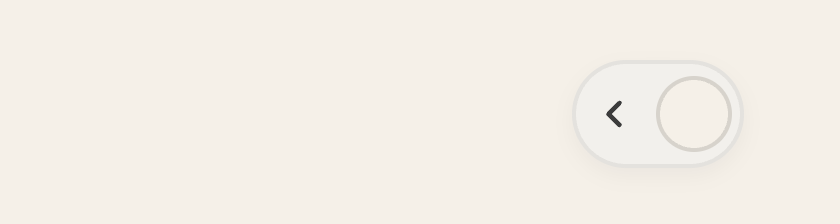
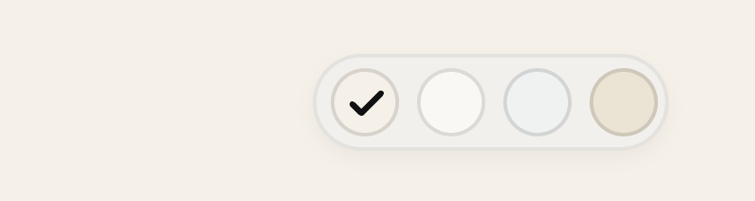
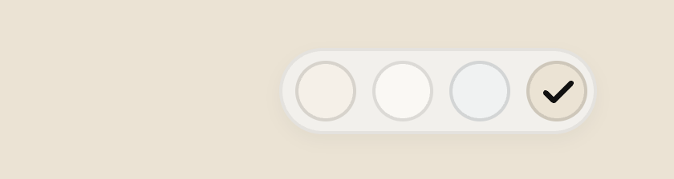

# devbar — what it looks like

Media for [`skills/devbar`](../../skills/devbar). It lives here, not in the skill
folder: `npx skills add` **copies** a skill folder onto every machine that
installs it, so binaries there are paid for on every install and sit in git
history forever. Skill folders stay text.

## The interaction

Hover expands the pill leftward, the chevron and preview dot fade out, the
swatches fade in; clicking one moves the checkmark and repaints the app live.

Source recording: [`devbar-demo.mp4`](devbar-demo.mp4) — 1512×1080, 60fps.
GitHub plays it on its own blob page; the webp above is what embeds inline.

## Stills

| Idle              | Hover               | After picking                      |
| ----------------- | ------------------- | ---------------------------------- |
|  |  |  |

Idle is a `‹` chevron plus one dot of the active value. Hovered, every swatch
shows with the checkmark on the active one. After clicking the fourth swatch the
check has moved and `--bg` repainted the page behind it.

The stills are the web template (`templates/devbar.js`) shot in headless Chrome;
the video is the SwiftUI one running in a real app.
